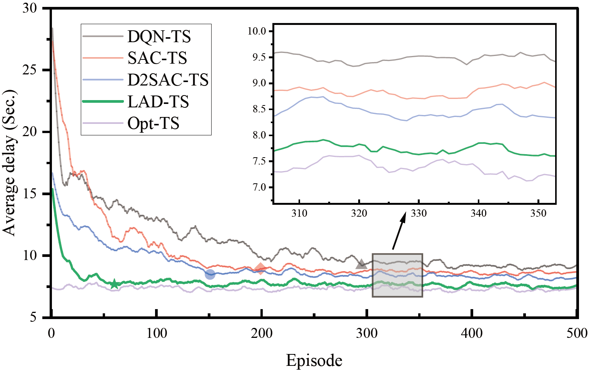
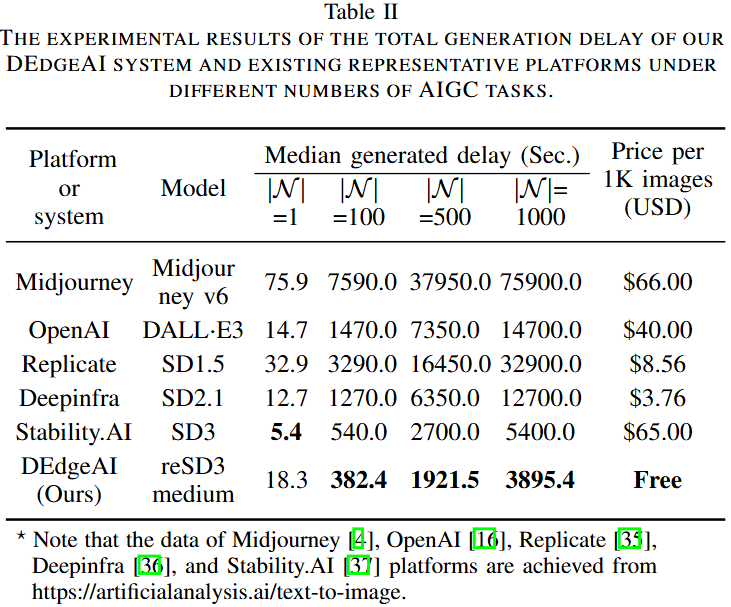

# DEdgeAI Implementation
This repo is an implementation of our paper "DEdgeAI: Latent Action Diffusion Scheduling for Edge-enabled Distributed AI-Generated Content", submitted to INFOCOM 2025. DEdgeAI is an edge-enabled distributed AIGC system that can orchestrate multiple ESs for expedited and resource-efficient AIGC processing. In this repo, we implement the proposed LAD-TS method, Baselines, and Refined SD3-medium deployment in our paper.

### Text-to-image with DEdgeAI
<div align=center>

</div>
DEdgeAI is implemented on distributed edge devices (e.g., Jetsons) with a refined SD3-medium model that is relatively lightweight and runs on a GPU with at least 16GB VRAM.

## I. LAD-TS Method
We propose LAD-TS, a Latent Action Diffusion-based Task Scheduling (LAD-TS) method to minimize the service delays in the dynamic MEC environment. LAD-TS optimizes task scheduling policy through probability reasoning, thus overcoming the performance instability of previous diffusion-based DRL methods.

### LADN Structure
<div align=center>

</div>
Compared to existing methods, our LAD-TS method utilizes the historical action probability instead of the Gaussian noise as the model input, ensuring a better offloading decision.

### Learning Performance 
<div align=center>

</div>
Our LAD-TS method achieves the lowest delay, outperforming the DQN-TS, SAC-TS, and D2SAC-TS methods by 13.66%, 9.19%, and 6.32%, respectively, and closely approximates the heuristic optimal method's (Opt-TS) delay.

### Code implementation
The code of the LAD-TS method is stored in the LAD-TS directory that mainly includes the following four files: 

- `diffusion_lad.py`: This file implements the latent action diffusion processing.

- `environment_lad.py`: This file implements the collaborative MEC environment that is initialized according to the given parameters in main_lad.py. 

- `model_lad.py`: This file implements the LAD model that mainly includes the Mulit-Layer Perception (MLP) network, Actor, Target network, Critic network, and Network training processing.

- `main_lad.py`: This file implements the LAD-TS algorithm's procedure. In this file, some key environment and model parameters are given. User can set by yourself. For instance, you can set the variable NUM_TASKS = 10 that represents the number of tasks arrived to each BS is in the range [1, 10] at a time slot t.

### Test Usage
User can run the `main_lad.py` to achieve the corresponding experimental results.
```sh
python3 main_lad.py
```

### Install
To run this code, please install some key packages: torch, NumPy, and matplotlib

## II. Baselines Implementation
In our paper, we use four baselines: DQN-TS, SAC-TS, D2SAC-TS, and Opt-TS.
The baselines are implemented in the Baselines directory. All the baselines are implemented with the same setup in our experiments.

(1) DQN-TS [1] baseline: DQN-TS is a DQN-based task scheduling method that has been widely applied to MEC technology. User can run the `main_dqn.py` to achieve experimental results. 

(2) SAC-TS [2] baseline: SAC-TS is a SAC-based task scheduling method that is the state-of-the-art method based on DRL. User can run the `main_sac.py` to achieve experimental results.

(3) D2SAC-TS [3] baseline: D2SAC-TS is the state-of-the-art scheduling method based on diffusion model and DRL. This code implementation can refer the [release code](https://github.com/Lizonghang/AGOD).

(4) Opt-TS baseline: Opt-TS is an optimal method that selects the most suitable ES to process each task by enumerating all action spaces. Opt-TS provides the upper bound on the performance of AIGC services, but it is infeasible since the scheduler has no way of knowing in advance the compute and network resources available for ESs in the actual MEC system. User can run the `main_opt.py` to achieve experimental results.

### Install
To run this code, please install some key packages: torch, NumPy, and matplotlib

## III. Refined SD3-medium  Implementation
The source code of the Stable Diffusion (SD) 3-medium model is released on the GitHub [sd3-ref](https://github.com/Stability-AI/sd3-ref). However, it requires a large memory (e.g., about 40 GB) to run, which is inappropriate for edge devices. Therefore, our repo implements a **refined** SD3(reSD3) medium service deployment that only needs 16 GB memory to run.

### Evaluation Results
The delay results of our DEdgeAI system and existing representative platforms under different numbers of AIGC tasks.
<div align=center>

</div>

### Code Implementation
This code implementation is based on the original SD3 medium mode at the [repo](https://github.com/Stability-AI/sd3-ref). Our refined SD3-medium code is stored in the reSD3-medium directory that mainly includes four files:
- `refine_sd3_infer.py` - entry point, review this for basic usage of diffusion model and the triple-tenc cat
- `sd3_impls.py` - contains the wrapper around the MMDiT and the VAE
- `refine_other_impls.py` - contains the CLIP model, the T5 model, and some utilities
- `mmdit.py` - contains the core of the MMDiT itself

### Test Usage
User can run the `refine_sd3_infer.py` to generate an image.
```sh
python3 refine_sd3_infer.py
```
Images will be output to `output.png` by default

### Install
To run this code, please install key packages: transformers, torch, torchvision, fire, pillow, numpy, einops, sentencepiece, protobuf

### File Guide
- folder `models` with the following files ([download](https://huggingface.co/stabilityai/stable-diffusion-3-medium/tree/main)):
    - `clip_g.safetensors` (openclip bigG can be downloaded in Hugging Face Platform)
    - `clip_l.safetensors` (OpenAI CLIP-L can be downloaded in Hugging Face Platform)
    - `sd3_medium.safetensors` (MMDiT model file can be downloaded in Hugging Face Platform)
- folder `dataset` with the file `Flickr8k_text.txt`. This file stores the text prompts those are extracted with the text labels from the public **Flickr8k** dataset.  We use the text in this file as the input of AIGC tasks in our experiments.
   
### SD3-medium Code Origin

The SD3-medium code included here originates from:
- Stability AI internal research code repository (MM-DiT)
- Public Stability AI repositories (e.g. VAE)
- Some unique code for this reference repo written by Alex Goodwin for Stability AI
- Some code from ComfyUI internal Stability impl of SD3 (for some code corrections and handlers)
- HuggingFace and upstream providers (for sections of CLIP/T5 code)

### Legal

MIT License

Copyright (c) 2024 Stability AI

Permission is hereby granted, free of charge, to any person obtaining a copy
of this software and associated documentation files (the "Software"), to deal
in the Software without restriction, including without limitation the rights
to use, copy, modify, merge, publish, distribute, sublicense, and/or sell
copies of the Software, and to permit persons to whom the Software is
furnished to do so, subject to the following conditions:

The above copyright notice and this permission notice shall be included in all
copies or substantial portions of the Software.

THE SOFTWARE IS PROVIDED "AS IS", WITHOUT WARRANTY OF ANY KIND, EXPRESS OR
IMPLIED, INCLUDING BUT NOT LIMITED TO THE WARRANTIES OF MERCHANTABILITY,
FITNESS FOR A PARTICULAR PURPOSE AND NONINFRINGEMENT. IN NO EVENT SHALL THE
AUTHORS OR COPYRIGHT HOLDERS BE LIABLE FOR ANY CLAIM, DAMAGES OR OTHER
LIABILITY, WHETHER IN AN ACTION OF CONTRACT, TORT OR OTHERWISE, ARISING FROM,
OUT OF OR IN CONNECTION WITH THE SOFTWARE OR THE USE OR OTHER DEALINGS IN THE
SOFTWARE.

#### Note

Some code in `other_impls` originates from HuggingFace and is subject to [the HuggingFace Transformers Apache2 License](https://github.com/huggingface/transformers/blob/main/LICENSE)

# References
[1] V. Mnih, K. Kavukcuoglu, D. Silver, A. A. Rusu, J. Veness, M. G. Bellemare, A. Graves, M. Riedmiller, A. K. Fidjeland, G. Ostrovski et al., “Human-level control through deep reinforcement learning,” nature, vol. 518, no. 7540, pp. 529–533, 2015. [Code](https://github.com/LiSir-HIT/Reinforcement-Learning/tree/main/Model/1.%20DQN)

[2] T. Haarnoja, A. Zhou, P. Abbeel, and S. Levine, “Soft actor-critic: Off-policy maximum entropy deep reinforcement learning with a stochastic actor,” in Proceedings of the 35th International Conference on Machine Learning (PMLR), vol. 80. PMLR, 2018, pp. 1861–1870. [Code](https://github.com/LiSir-HIT/Reinforcement-Learning/tree/main/Model/8.%20SAC_Discrete)

[3] H. Du, Z. Li, D. Niyato, J. Kang, Z. Xiong, H. Huang, and S. Mao, “Diffusion-based reinforcement learning for edge-enabled ai-generated content services,” IEEE Transactions on Mobile Computing, 2024. [Code](https://github.com/Lizonghang/AGOD)

[4] C. Xu, J., Guo, Y. Li, H. Zou, W. Jia, and T. Wang, “Dynamic Parallel Multi-Server Selection and Allocation in Collaborative Edge Computing”, IEEE Transactions on Mobile Computing, 2024. [Paper](https://ieeexplore.ieee.org/abstract/document/10470372)

[5] C. Xu, J. Guo, J. Zeng, S. Meng, X. Chu, J. Cao, and T. Wang, “Enhancing AI-Generated Content Efficiency through Adaptive Multi-Edge Collaboration”, The 44th IEEE International Conference on Distributed Computing Systems (ICDCS 2024), Jersey City, New Jersey, USA. 23 July - 26 July, 2024. [Code](https://github.com/ChangfuXu/AMCoEdge)
